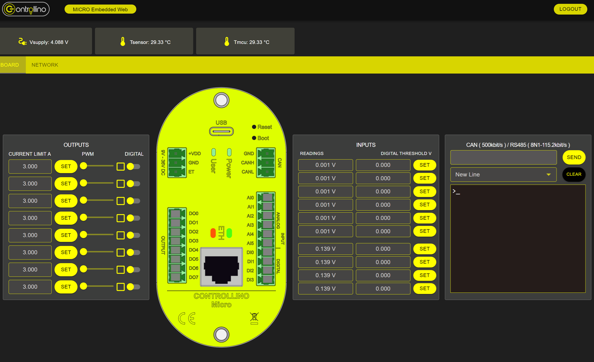
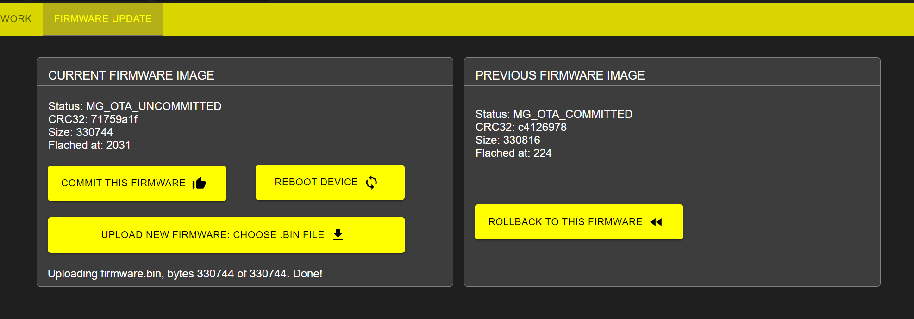

# Embbeded web to test Controllino MICRO features

The project provides an easy to install tool to test the main features of the Controllino MICRO by serving an embedded web application directly from the device, easilly accesible from any web browser.



## Fast get started

### Download latest firmware

- Controllino MICRO RS485 **.uf2** <https://github.com/CONTROLLINO-PLC/micro_embedded_web/releases/download/global/web_micro_rs485.uf2>
- Controllino MICRO CAN **.uf2** <https://github.com/CONTROLLINO-PLC/micro_embedded_web/releases/download/global/web_micro_can.uf2>

### Upload firmware

For easy installation first it is necessary to put the device in bootloader mode, to do this:

- First method: Without external power press the boot button while connecting the USB cable, and then release the button.
- Second method: Press both boot and reset buttons at the same time, then release the reset button and finally release the boot button.

The board will appear as a mass storage device, copy then the **.uf2** file to the device, it will reboot and start the web server.

### Connect to the web server

The default IP address is **10.22.1.184** and the default user and password are **admin** and **admin** respectively so just open a browser and go to <http://10.22.1.184/> to access the web server. Enjoy!

### OTA(Over Ethernet) Firmware update



In the tap **FIRMWARE UPDATE** you can update the firmware using the OTA feature.

1. The firmware update process begin by uploading a new .bin firmware file on **UPLOAD NEW FIRMWARE: CHOOSE .BIN FILE** button, after uploaded the status of this current firmware will be **MG_OTA_UNCOMMITTED**.

2. To mark the uploaded firmware to be applied in the next reboot **COMMIT THIS FIRMWARE** button must be pressed, the status will change to **MG_OTA_COMMITTED**.

3. After the next reboot for example by pressing the **REBOOT DEVICE** button the firmware will be updated and the status will change to **MG_OTA_FIRST_BOOT**.

4. On the next reboot the current firmware will be saved as previous firmware with the status **MG_OTA_COMMITTED** and the current firmware info will be reseted. At any point you can come back to this old firmware by pressing the **ROLLBACK TO THIS FIRMWARE** button, except if a new firmware goes through all the process.

5. When pressing the **ROLLBACK TO THIS FIRMWARE** button the board will reboot and apply the previous firmware kepping previous firmware info.

Here there are some .bin files to test the OTA feature:

- Controllino MICRO RS485:
  - User led blink 1s <https://github.com/CONTROLLINO-PLC/micro_embedded_web/releases/download/global/web_micro_rs485_blink_1s.bin>
  - User led blink 200ms <https://github.com/CONTROLLINO-PLC/micro_embedded_web/releases/download/global/web_micro_rs485_blink_200ms.bin>

- Controllino MICRO CAN:
  - User led blink 1s <https://github.com/CONTROLLINO-PLC/micro_embedded_web/releases/download/global/web_micro_can_blink_1s.bin>
  - User led blink 200ms <https://github.com/CONTROLLINO-PLC/micro_embedded_web/releases/download/global/web_micro_can_blink_200ms.bin>

## Tools and technologies used

- PlatformIO to manage the project and build the firmware.
- Mongoose web server as core to genrate the web server app.
- React js to develop the web app.

## Internal and external dependencies description

- From [controllino_rp2040_firmmware](https://github.com/CONTROLLINO-PLC/controllino_rp2040_firmware)
  - SPI library [lib/SPI](lib/SPI) until internal the SPI code for the internal MICRO components works good with the new SPI library version on Arduino-Pico.
  - CAN modified version of Arduino CAN library (MCP2515) [lib/arduino_can](lib/arduino_can) original library [here](https://github.com/sandeepmistry/arduino-CAN)
  - Controllino MICRO variant firmware [lib/controllino_micro](lib/controllino_micro)
- From Arduino-Pico <https://github.com/earlephilhower/arduino-pico> OTA related libraries
  - LittleFS [lib/LittleFS](lib/LittleFS)
  - PicoOTA [lib/PicoOTA](lib/PicoOTA)
  - Updater [lib/Updater](lib/Updater)
  - MD5Builder [lib/MD5Builder](lib/MD5Builder)
- Mongoose OTA and device port for Arduino-Pico [lib/mongoose_arduino_pico](lib/mongoose_arduino_pico)
- Mongoose web server application [lib/webapp](lib/webapp) based on device dashboard example
- External dependencies installed with PlatformIO see [platformio.ini](platformio.ini)
  - ArduinoJson
  - ArduinoRS485

## Web development project

Developed on react js uses also gulp to automate some parts of the build process, trying to generate the minimal weight app to embed in the microcontroller.

On PlatformIO build [build_web.py](build_web.py) script is executed to build the web app into [lib/webapp/packed_fs.c](lib/webapp/packed_fs.c) source file that later is compiled with the firmware.

### Requirements

- node v18.x.x
- npm v8.x.x
- react v18.x.x
- Python 3.x.x

### Manual setup for web development

``` bash
cd webdev
```

``` bash
npm install
```

### Start development server

``` bash
npm run dev
```

### React project description

- Login
  - Description: Component to get access to the dashboard using user credentials.
  - ubication: [webdev/src/components/Login.jsx](webdev/src/components/Login.jsx)
  - used in:
    - App

- Home
  - description: Display all main screen components
  - ubication: [webdev/src/components/Home.jsx](webdev/src/components/Home.jsx)
  - used in:
    - App

- Navbar
  - description: Header of the web app and render some features as logout
  - ubication: [webdev/src/components/Navbar.jsx](webdev/src/components/Navbar.jsx)
  - used in:
    - Home

- FormComms
  - description: Form to manage the network configuration
  - ubication: [webdev/src/components/FormComms.jsx](webdev/src/components/FormComms.jsx)
  - used in:
    - Home

- FormBoard
  - description: Main form to manage the board
  - ubication: [webdev/src/components/FormBoard.jsx](webdev/src/components/FormBoard.jsx)
  - used in:
    - Home

- Inputs, Outputs and ComComponent
  - description: Actuate and configure inputs, outputs and serial comunications
  - ubication:
    - [webdev/src/components/comComponen.jsx](webdev/src/components/comComponen.jsx)
    - [webdev/src/components/Inputs.jsx](webdev/src/components/Inputs.jsx)
    - [webdev/src/components/Outputs.jsx](webdev/src/components/Outputs.jsx)
  - used in:
    - FormBoard

- ItemContainer
  - description: Container to display inputs, outputs and serial comunications
  - ubication: [webdev/src/components/ItemContainer.jsx](webdev/src/components/ItemContainer.jsx)
  - used in:
    - Inputs
    - Outputs
    - ComComponent

- LedInput, LedOutput and NetworkLeds
  - description: Component to visually display network activity and digital states of inputs and outputs
  - ubication:
    - [webdev/src/components/LedInputs.jsx](webdev/src/components/LedInputs.jsx)
    - [webdev/src/components/LedOutput.jsx](webdev/src/components/LedOutput.jsx)
    - [webdev/src/components/networkLeds.jsx](webdev/src/components/networkLeds.jsx)
  - used in:
    - FormBoard

- TmcuCard, TsensorCard and VsupplyCard
  - description: Card like component to monitor certain internal variables
  - ubication:
    - [webdev/src/components/TmcuCard.jsx](webdev/src/components/TmcuCard.jsx)
    - [webdev/src/components/TsensorCard.jsx](webdev/src/components/TsensorCard.jsx)
    - [webdev/src/components/VsupplyCard.jsx](webdev/src/components/VsuplyCard.jsx)
  - used in:
    - Home
